# DANZ-368 티켓 설정·사용자 화면 캡처

2026-10-01 로컬 Docker 환경에서 촬영한 실제 화면 19장입니다. 관리자 계정과 사용자 확인에는 테스트 계정을 사용했습니다. 저장 전 편집 화면, 저장 후 화면, 예시 카드 미리보기를 각 설명에서 구분합니다.

- 관리자: /admin → 티켓팅 → /admin/ticketing → 설정 저장
- 사용자: /ticket → /ticket/ticketing, OFF 시 입장 안내
- 운영: 티켓팅 → 팔찌 배부 ↗ → /ticket/admin
- 촬영 중 ON/OFF와 이미지 업로드·기본 복원을 확인했습니다. 최종 상태는 ON, 이미지 URL 두 개 모두 null(기본 배경), 기존 3개 회차 유지입니다.
- 신규 티켓 발급·회원가입 완료·팔찌 수령 처리·회차 삭제는 실행하지 않았습니다.

## 01. 축제 설정에서 티켓 메뉴 진입

축제 이름과 9/1~9/3 운영 기간, 자동으로 만들어진 1~3일차를 확인합니다. 상단 티켓팅 메뉴에서 ‘티켓 설정’ 또는 ‘팔찌 배부 ↗’로 이동합니다. 화살표는 별도 업무 화면으로 이동한다는 표시이며, 현재 창에서 이동합니다.

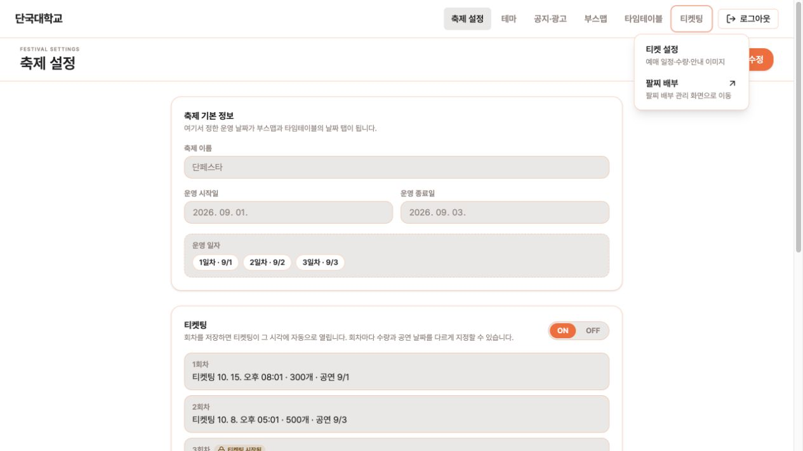

## 02. ON 상태에서 회차별 설정 수정

‘수정’을 누르거나 ON/OFF를 조작하면 편집 상태가 됩니다. 아직 시작하지 않은 회차는 티켓팅 시작 날짜·시간, 티켓 수량, 공연 날짜를 수정할 수 있습니다. 공연 날짜는 축제 운영일 중 선택합니다. 모든 운영일에 회차를 만들 필요는 없습니다. 사진은 저장 전 상태입니다.

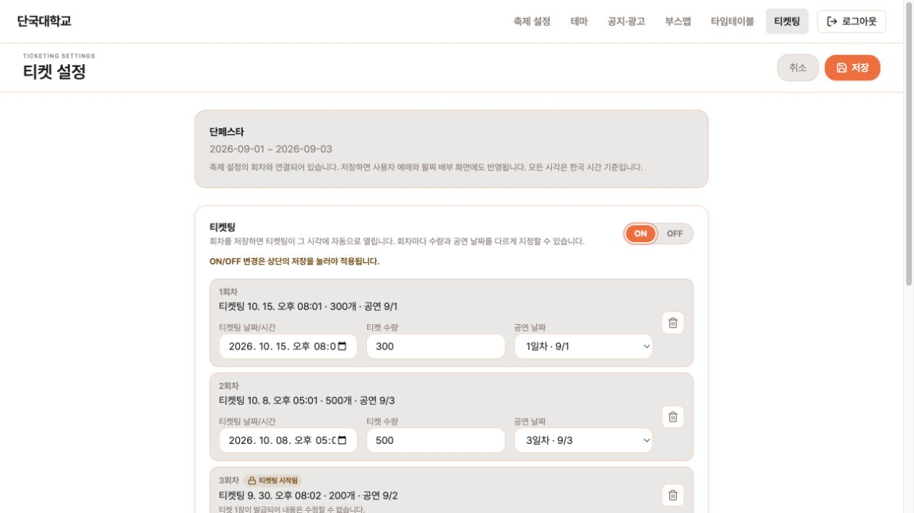

## 03. 새 회차 입력과 ‘회차 추가’

새 회차 입력란의 세 값을 채우고 ‘회차 추가’를 누른 다음, 상단 ‘저장’을 눌러야 DB에 반영됩니다. 사진은 시작 시각을 아직 입력하지 않은 작성 중 상태입니다. 작성 중인 입력을 그대로 두고 저장하면 추가하거나 닫으라는 안내가 나옵니다. 이번 촬영에서는 추가·저장하지 않고 취소했습니다.

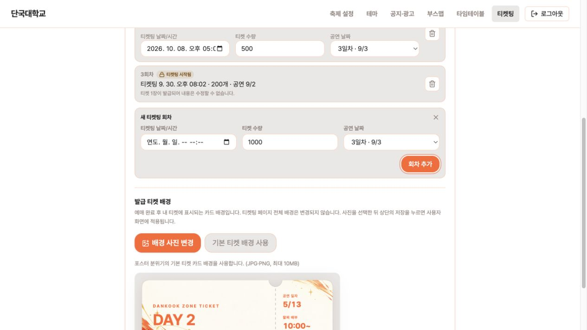

## 04. 티켓팅 시작 후 수정 잠금

이미 열린 3회차에는 잠금 표시와 발급된 티켓 1장 안내가 보이고, 시간·수량·공연일 편집란은 제공되지 않습니다. 다른 미시작 회차나 배경은 수정할 수 있습니다. 잠금은 화면 표시뿐 아니라 BE에서도 검사합니다.

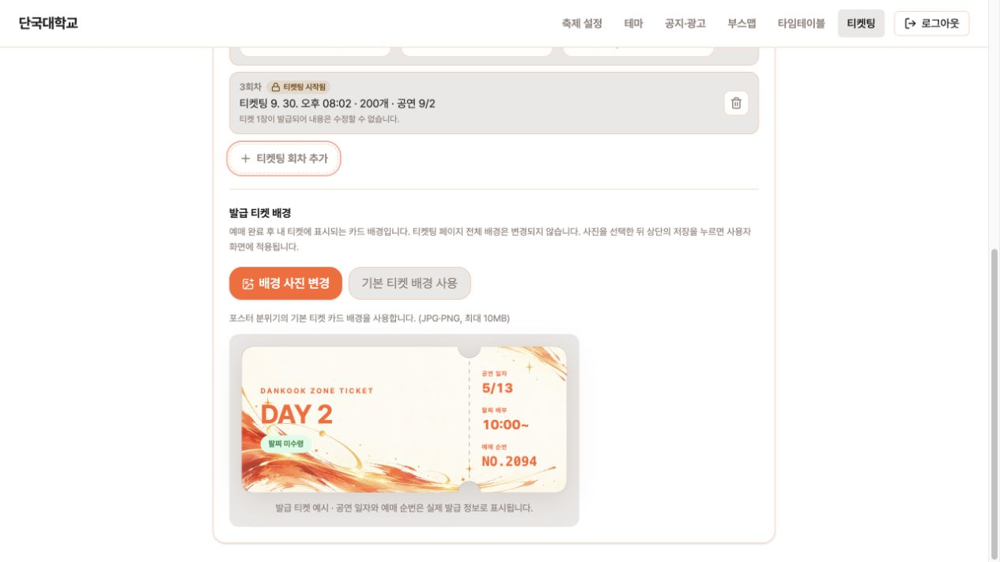

## 05. 발급된 회차의 삭제는 별도 확인

수정 잠금과 회차 삭제는 별도 정책입니다. 발급된 티켓이 있는 회차의 삭제 버튼을 누르면 발급 수량과 티켓도 함께 취소된다는 설명을 표시합니다. 삭제 확인 후 상단 저장 시 실제 삭제됩니다. 캡처에서는 확인 창만 열고 취소했으며, 회차·티켓을 삭제하지 않았습니다.

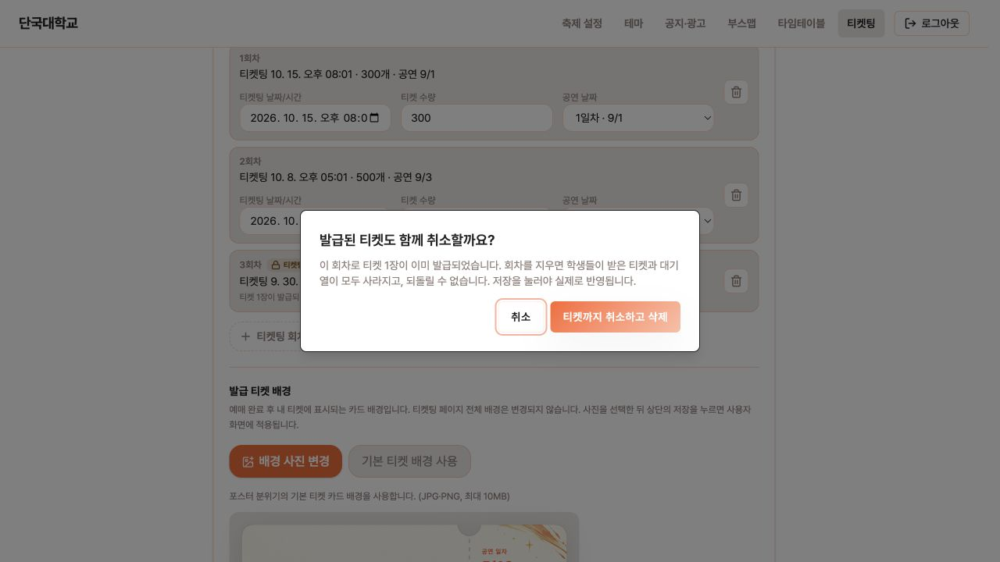

## 06. OFF 선택 직후: 아직 저장 전

OFF를 누르면 상단이 ‘취소 / 저장’으로 바뀌고, 저장해야 사용자 화면에 반영된다는 안내가 표시됩니다. 토글을 누른 것만으로 서비스가 꺼지지 않습니다. 취소하면 마지막 저장 상태를 다시 불러옵니다.

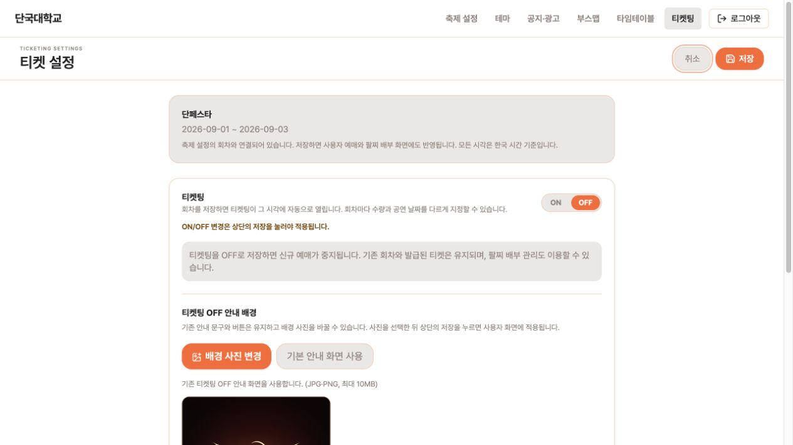

## 07. OFF 저장 완료

상단 버튼이 다시 ‘수정’으로 돌아오면 저장된 조회 상태입니다. 티켓팅 OFF에서는 안내 배경 변경 영역을 제공합니다. OFF로 저장해도 기존 회차와 발급 티켓을 삭제하지 않습니다.

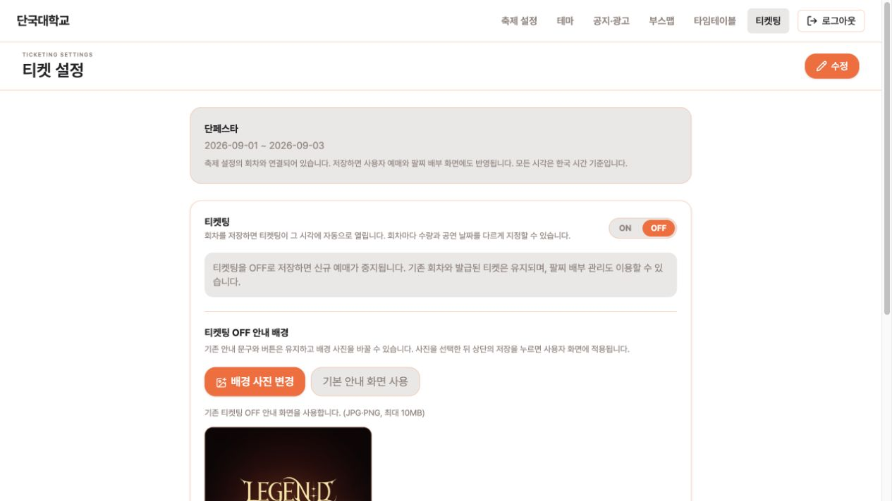

## 08. 기본 OFF 안내 화면 미리보기

‘기본 안내 화면 사용’을 선택해 저장하면 기존 LEGEND 안내 화면을 사용합니다. 관리자 미리보기에서도 실제 사용자 화면과 같은 로고, 입장 안내, 홈 이동 버튼을 확인할 수 있습니다.

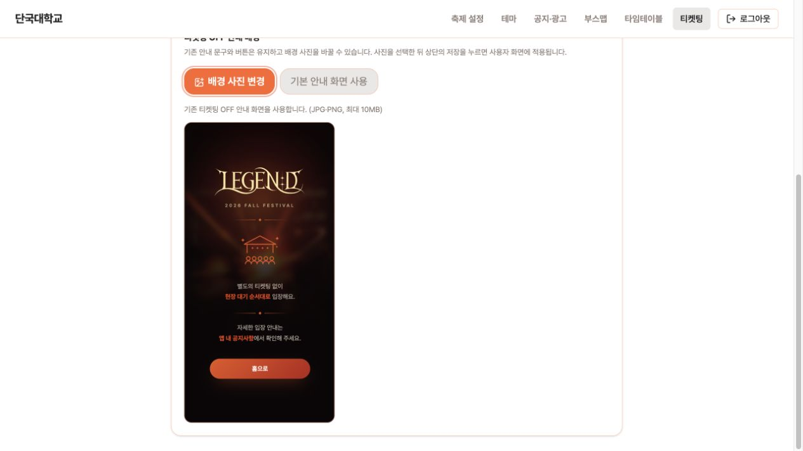

## 09. 사용자 화면에 OFF 정책 반영

사용자가 티켓팅에 들어가면 기본 입장 안내가 표시됩니다. 이 화면은 티켓팅 OFF 안내이며 발급된 티켓 카드 배경과 별개의 설정입니다. 사용자 안내 화면에서 홈으로 돌아갈 수 있습니다.

## 10. OFF여도 로그인 가능

티켓팅을 끈 상태에서도 /ticket/login에 접근할 수 있습니다. 신규 예매를 막는 기능이므로 로그인 경로까지 막지 않습니다.

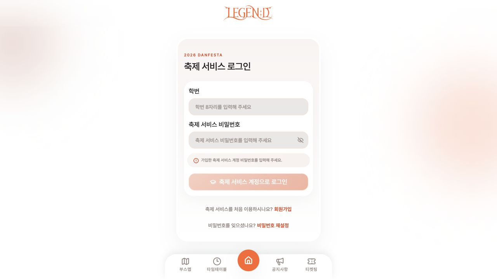

## 11. OFF여도 회원가입 가능

티켓팅을 끈 상태에서도 /ticket/signup의 가입 양식과 동의 항목에 접근할 수 있습니다. 사진은 가입 화면 접근 확인이며 실제 신규 가입을 완료한 결과가 아닙니다.

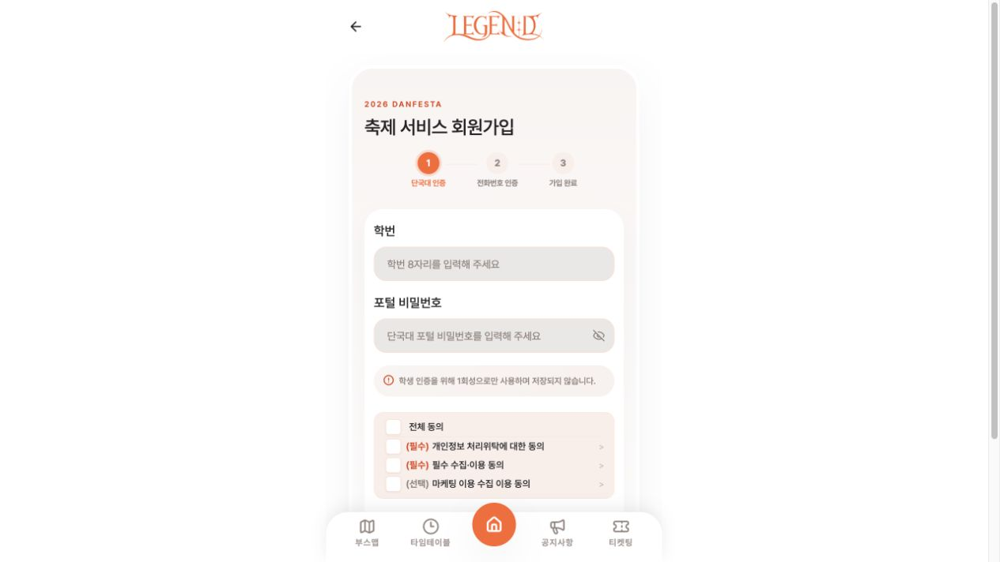

## 12. OFF여도 내정보 유지

테스트용 계정으로 로그인한 상태에서 /mypage에 접근했습니다. 계정 정보와 내 티켓 메뉴를 확인할 수 있습니다. 이 테스트 계정의 보유 티켓은 0장입니다. 기존 티켓 조회 API를 OFF 차단 대상에서 제외한 동작은 BE 테스트로 별도 확인했습니다.

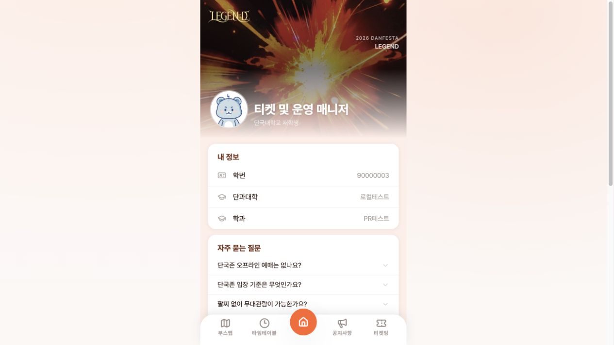

## 13. ON 저장 후 사용자 티켓팅 홈

관리자가 다시 ON으로 저장하면 사용자 티켓팅 홈을 이용할 수 있습니다. 전체 페이지는 기존 배경을 유지합니다. 관리자에서 바꾸는 ‘발급 티켓 배경’은 이 페이지 전체 배경을 바꾸지 않습니다.

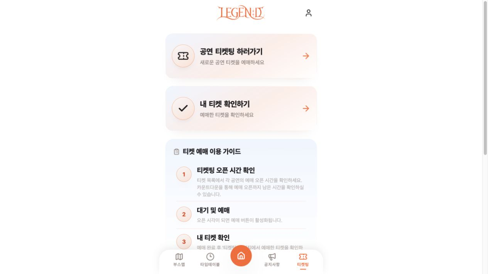

## 14. 축제 이름·DAY와 예매 시작 시각 반영

목록은 설정에 연결된 회차만 표시합니다. 제목은 ‘축제 이름 + DAY n’, 두 번째 줄은 티켓팅 시작 날짜·시각(한국 시간)입니다. 수량은 사용자 카드에서 제외했습니다. DAY는 공연일의 축제 내 일차이므로 등록 순서와 달라도 실제 공연일 순서로 보입니다. 사진의 날짜는 화면 검증용 로컬 데이터입니다.

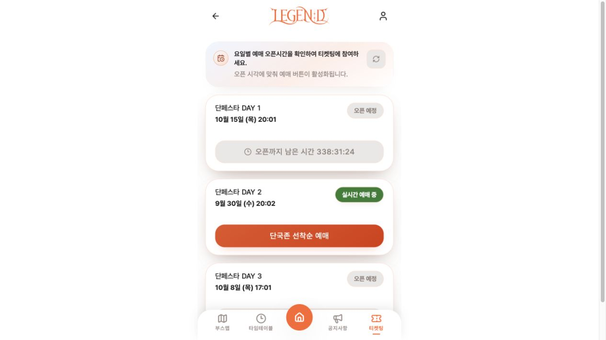

## 15. 열린 회차의 예매 안내 진입

열린 DAY 2 회차에서 예매 절차로 들어가면 주의사항과 부정거래 방침을 확인할 수 있습니다. 이번 촬영은 안내 화면 진입까지 확인했으며 추가 티켓을 발급하지 않았습니다.

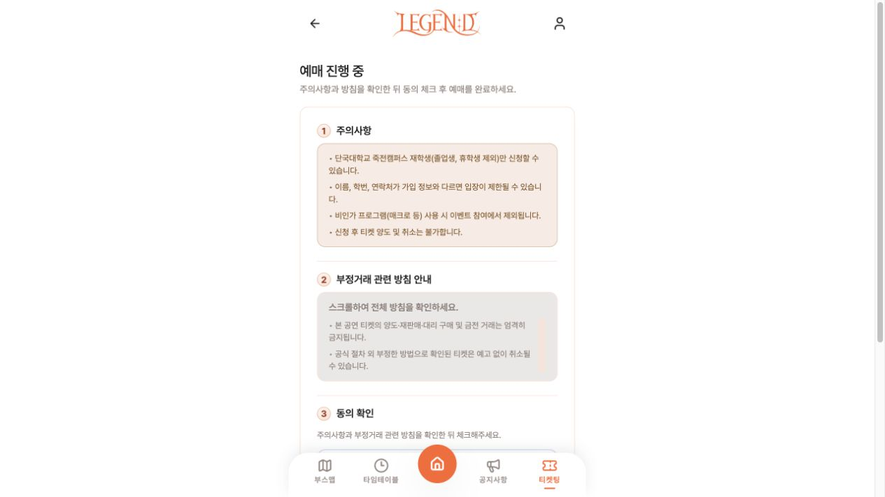

## 16. 필수 동의 확인

필수 동의 항목이 체크되지 않으면 ‘예매 완료’ 버튼이 비활성화됩니다. 캡처에서는 동의 체크나 최종 예매를 실행하지 않았습니다. PROCESSING 결과 조회 및 오류 분기는 자동화 테스트 결과와 함께 리뷰합니다.

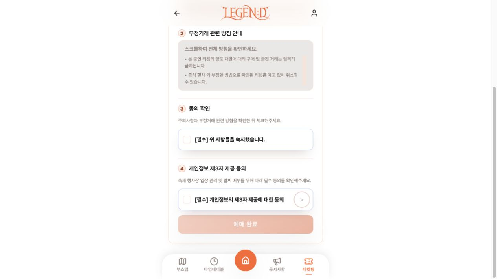

## 17. 발급 티켓 배경 사진 선택: 저장 전 미리보기

ON 상태의 ‘발급 티켓 배경’에서 JPG/PNG 파일을 선택하면 파일명과 카드 미리보기를 보여줍니다. 상단 저장 시 이미지 업로드 후 URL이 설정에 저장됩니다. 촬영 중 실제 업로드·저장과 이미지 HTTP 200 응답까지 확인한 뒤 기본 배경으로 복원했습니다.

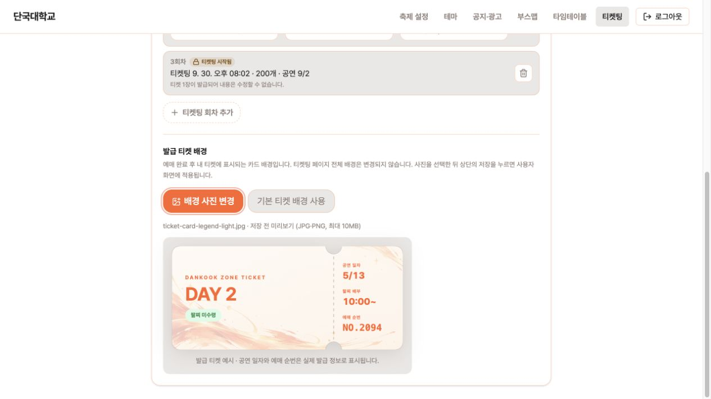

## 18. 기본 발급 티켓 디자인과 주황색 글자

기본 카드는 아이보리 바탕에 주황·금색 패턴을 사용합니다. DANKOOK ZONE TICKET, DAY, 공연 일자, 팔찌 배부, 예매 순번의 라벨과 값에 테마 강조색을 적용했습니다. 상태 배지는 상태별 색상을 유지합니다. 이 사진은 관리자 공용 카드 미리보기로, 5/13·NO.2094는 예시 값이며 실제 발급 결과가 아닙니다. 실제 내 티켓에서는 API의 공연일·예매 순번을 사용합니다. 팔찌 배부 시간 10:00~는 현재 고정 표기입니다.

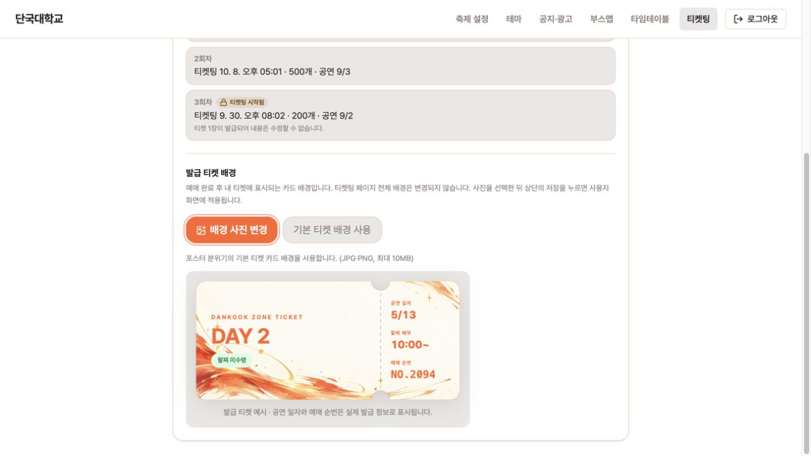

## 19. 팔찌 배부 화면에 같은 DB 설정 반영

관리자의 ‘팔찌 배부 ↗’에서 /ticket/admin으로 이동합니다. 배부 목록은 같은 설정에 연결된 이벤트를 읽고 축제 이름·DAY, 공연일, 티켓팅 시작 시각, 수량을 표시합니다. 사용자 목록에서 생략한 수량도 운영 화면에서는 확인할 수 있습니다. 사진에서는 각 공연일에 맞춰 DAY 1/2/3으로 정렬됩니다.

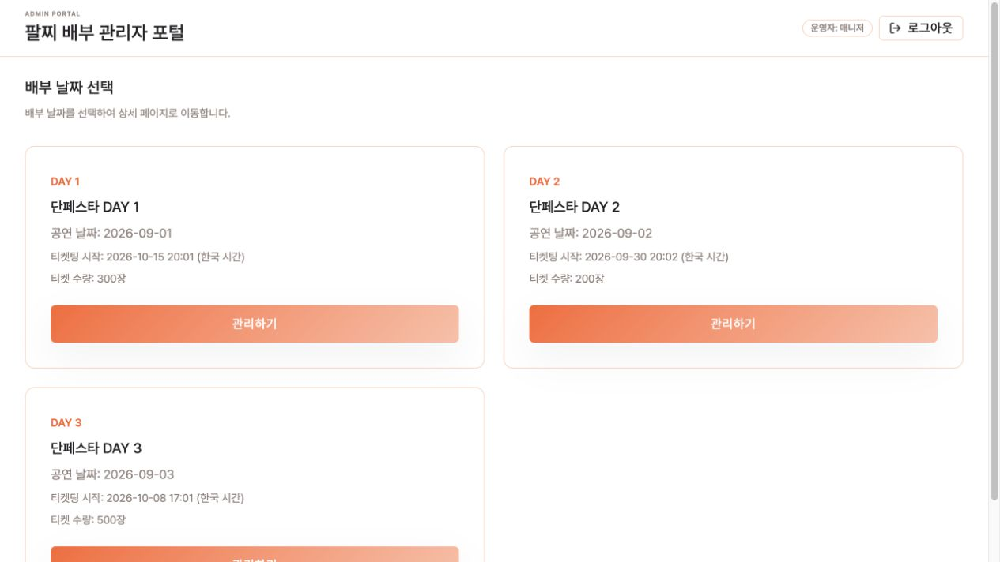

## 검증 결과와 범위

- FE: 105개 파일 / 436개 테스트 통과. CI 구조 실패 보완 후 린트, 전체 구조 report, 순환 의존, 커버리지, 빌드, 앱/테스트 타입 검사, 변경 파일 구조 검사, 번들 제한 통과(269.55 / 488.28 KiB).
- BE: 380개 중 368개 통과, 12개 스킵, 실패·오류 0. Java 17 Docker와 별도 Redis로 실행했습니다.
- 화면의 실제 신규 발급 성공을 증명하는 캡처는 이번 자료에 없습니다. 관리자 카드 예시를 신규 발급 결과로 해석하지 않습니다.
- 다른 탭은 포커스 복귀 또는 최대 30초 주기 조회로 설정을 다시 확인합니다. 서버 푸시 방식은 아닙니다.
- 상세 동작과 DB·환경 설정 차이는 각 저장소의 docs/ticket-settings.md와 PR 본문을 참고합니다.
